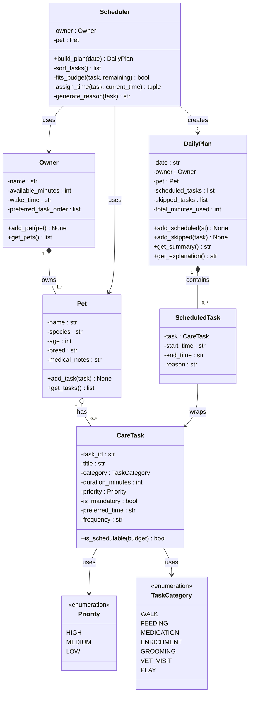

# PawPal+ (Module 2 Project)

You are building **PawPal+**, a Streamlit app that helps a pet owner plan care tasks for their pet.

## Scenario

A busy pet owner needs help staying consistent with pet care. They want an assistant that can:

- Track pet care tasks (walks, feeding, meds, enrichment, grooming, etc.)
- Consider constraints (time available, priority, owner preferences)
- Produce a daily plan and explain why it chose that plan

Your job is to design the system first (UML), then implement the logic in Python, then connect it to the Streamlit UI.

## What you will build

Your final app should:

- Let a user enter basic owner + pet info
- Let a user add/edit tasks (duration + priority at minimum)
- Generate a daily schedule/plan based on constraints and priorities
- Display the plan clearly (and ideally explain the reasoning)
- Include tests for the most important scheduling behaviors

## Getting started

### Setup

```bash
python -m venv .venv
source .venv/bin/activate  # Windows: .venv\Scripts\activate
pip install -r requirements.txt
```

### Suggested workflow

1. Read the scenario carefully and identify requirements and edge cases.
2. Draft a UML diagram (classes, attributes, methods, relationships).
3. Convert UML into Python class stubs (no logic yet).
4. Implement scheduling logic in small increments.
5. Add tests to verify key behaviors.
6. Connect your logic to the Streamlit UI in `app.py`.
7. Refine UML so it matches what you actually built.

## UML Design

### Class Diagram (Mermaid)

> Paste the code block below into the [Mermaid Live Editor](https://mermaid.live) to render the diagram.



### Scheduler Logic

1. **Sort** — Tasks sorted by `Priority` (HIGH first), then `is_mandatory`, then `preferred_time`
2. **Fit** — Walk through sorted tasks; if `duration_minutes <= remaining_budget`, schedule it
3. **Assign time** — Track a `current_time` cursor starting at `owner.wake_time`, advance it per task
4. **Reason** — For each scheduled task, generate a human-readable explanation
5. **Skip** — Tasks that don't fit go into `skipped_tasks` with a reason
6. **Output** — `DailyPlan.get_explanation()` returns the full narrative displayed in the UI

## Brainstorm

### Object 1: `Owner`
**What is it?** The human using the app. They set the constraints the scheduler must respect.

| Attributes | Why we need it |
|---|---|
| `name` | Personalize the UI and plan output |
| `available_minutes` | The total time budget for the day |
| `wake_time` | When the schedule should start |
| `preferred_task_order` | Some owners want walks first, others feeding first |

| Methods | Why we need it |
|---|---|
| `add_pet(pet)` | Associate a pet with this owner |
| `get_pets()` | Retrieve the list of pets to schedule for |

---

### Object 2: `Pet`
**What is it?** The animal being cared for. Holds identity and medical context.

| Attributes | Why we need it |
|---|---|
| `name` | Display in the plan ("Mochi's schedule") |
| `species` | Dog vs cat affects default task types |
| `age` | Older pets may need more frequent meds/shorter walks |
| `breed` | High-energy breeds may need more enrichment |
| `medical_notes` | Free-text for vet instructions, allergies, special needs |

| Methods | Why we need it |
|---|---|
| `add_task(task)` | Attach a care task to this pet |
| `get_tasks()` | Return all tasks so the scheduler can process them |

---

### Object 3: `CareTask`
**What is it?** A single care activity. The core unit of the whole system.

| Attributes | Why we need it |
|---|---|
| `task_id` | Unique identifier for tracking/editing |
| `title` | Human-readable name ("Morning Walk") |
| `category` | Groups tasks — uses `TaskCategory` enum |
| `duration_minutes` | How long it takes — key for fitting into the budget |
| `priority` | HIGH/MEDIUM/LOW — drives scheduling order |
| `is_mandatory` | Meds are non-negotiable; play is optional |
| `preferred_time` | Owner wants feeding at 8am, walk at 7am |
| `frequency` | Daily vs weekly affects whether it appears today |

| Methods | Why we need it |
|---|---|
| `is_schedulable(budget)` | Quick check: does this task fit in remaining time? |

---

### Object 4: `Scheduler`
**What is it?** The brain of the app. Takes the owner + pet and produces a plan.

| Attributes | Why we need it |
|---|---|
| `owner` | Source of time budget and wake time |
| `pet` | Source of the task list |

| Methods | Why we need it |
|---|---|
| `build_plan(date)` | Main entry point — returns a `DailyPlan` |
| `_sort_tasks()` | Internal: rank tasks by priority + mandatory flag |
| `_fits_budget(task, remaining)` | Internal: check if task fits in remaining minutes |
| `_assign_time(task, current_time)` | Internal: calculate start/end time for a task |
| `_generate_reason(task)` | Internal: produce human-readable explanation for each decision |

---

### Object 5: `ScheduledTask`
**What is it?** A wrapper that pairs a `CareTask` with its assigned time slot and reasoning. Created by the Scheduler.

| Attributes | Why we need it |
|---|---|
| `task` | The original `CareTask` being scheduled |
| `start_time` | When it begins ("08:00") |
| `end_time` | When it ends ("08:20") |
| `reason` | Why it was scheduled ("HIGH priority + mandatory") |

> No methods needed — this is a pure data container (value object).

---

### Object 6: `DailyPlan`
**What is it?** The final output. Holds everything the UI needs to display.

| Attributes | Why we need it |
|---|---|
| `date` | Which day this plan is for |
| `owner` | Reference back to the owner |
| `pet` | Reference back to the pet |
| `scheduled_tasks` | List of `ScheduledTask` objects — what got in |
| `skipped_tasks` | List of `CareTask` objects — what got cut and why |
| `total_minutes_used` | Quick stat for the UI display |

| Methods | Why we need it |
|---|---|
| `add_scheduled(st)` | Add a task that made the cut |
| `add_skipped(task)` | Add a task that was dropped |
| `get_summary()` | Short one-liner: "6 tasks, 110 min used of 180" |
| `get_explanation()` | Full narrative the UI displays to the user |

---

### Supporting Enums

**`Priority`** — gives tasks a sortable numeric weight

| Value | Score |
|---|---|
| HIGH | 3 |
| MEDIUM | 2 |
| LOW | 1 |

**`TaskCategory`** — groups tasks for filtering and display

`WALK` / `FEEDING` / `MEDICATION` / `ENRICHMENT` / `GROOMING` / `VET_VISIT` / `PLAY`

---

### Key Design Decisions

1. **One pet or many?** — Start with one pet per plan to keep it simple, add multi-pet later.
2. **Mandatory tasks** — A mandatory task always gets scheduled first regardless of time pressure.
3. **Time conflicts** — If two tasks share a `preferred_time`, higher priority wins.
4. **Frequency logic** — Stub as always-daily for v1; weekly frequency added in a later iteration.

---

## Python Class Stubs (Step 3)

These are the class skeletons derived directly from the UML and brainstorm. No logic yet — just structure.

```python
from enum import Enum
from typing import Optional


# --- Enums ---

class Priority(Enum):
    HIGH   = 3
    MEDIUM = 2
    LOW    = 1


class TaskCategory(Enum):
    WALK        = "walk"
    FEEDING     = "feeding"
    MEDICATION  = "medication"
    ENRICHMENT  = "enrichment"
    GROOMING    = "grooming"
    VET_VISIT   = "vet_visit"
    PLAY        = "play"


# --- Core Data Classes ---

class CareTask:
    """A single pet care activity."""

    def __init__(
        self,
        task_id: str,
        title: str,
        category: TaskCategory,
        duration_minutes: int,
        priority: Priority,
        is_mandatory: bool = False,
        preferred_time: Optional[str] = None,
        frequency: str = "daily",
    ):
        self.task_id = task_id
        self.title = title
        self.category = category
        self.duration_minutes = duration_minutes
        self.priority = priority
        self.is_mandatory = is_mandatory
        self.preferred_time = preferred_time
        self.frequency = frequency

    def is_schedulable(self, budget: int) -> bool:
        """Return True if this task fits within the remaining time budget."""
        pass  # TODO: implement


class Pet:
    """The animal being cared for."""

    def __init__(
        self,
        name: str,
        species: str,
        age: int,
        breed: str = "",
        medical_notes: str = "",
    ):
        self.name = name
        self.species = species
        self.age = age
        self.breed = breed
        self.medical_notes = medical_notes
        self._tasks: list[CareTask] = []

    def add_task(self, task: CareTask) -> None:
        """Attach a care task to this pet."""
        pass  # TODO: implement

    def get_tasks(self) -> list[CareTask]:
        """Return all tasks assigned to this pet."""
        pass  # TODO: implement


class Owner:
    """The human using the app — defines time constraints and preferences."""

    def __init__(
        self,
        name: str,
        available_minutes: int,
        wake_time: str = "07:00",
        preferred_task_order: Optional[list[str]] = None,
    ):
        self.name = name
        self.available_minutes = available_minutes
        self.wake_time = wake_time
        self.preferred_task_order = preferred_task_order or []
        self._pets: list[Pet] = []

    def add_pet(self, pet: Pet) -> None:
        """Associate a pet with this owner."""
        pass  # TODO: implement

    def get_pets(self) -> list[Pet]:
        """Return all pets belonging to this owner."""
        pass  # TODO: implement


# --- Output / Value Objects ---

class ScheduledTask:
    """A CareTask that has been placed on the timeline with a reason."""

    def __init__(self, task: CareTask, start_time: str, end_time: str, reason: str):
        self.task = task
        self.start_time = start_time
        self.end_time = end_time
        self.reason = reason


class DailyPlan:
    """The final daily schedule produced by the Scheduler."""

    def __init__(self, date: str, owner: Owner, pet: Pet):
        self.date = date
        self.owner = owner
        self.pet = pet
        self.scheduled_tasks: list[ScheduledTask] = []
        self.skipped_tasks: list[CareTask] = []
        self.total_minutes_used: int = 0

    def add_scheduled(self, st: ScheduledTask) -> None:
        """Add a task that made it into the plan."""
        pass  # TODO: implement

    def add_skipped(self, task: CareTask) -> None:
        """Add a task that was dropped from the plan."""
        pass  # TODO: implement

    def get_summary(self) -> str:
        """Return a short one-liner summary of the plan."""
        pass  # TODO: implement

    def get_explanation(self) -> str:
        """Return the full narrative explanation to display in the UI."""
        pass  # TODO: implement


# --- Scheduler (the brain) ---

class Scheduler:
    """Builds a DailyPlan for a pet based on owner constraints and task priorities."""

    def __init__(self, owner: Owner, pet: Pet):
        self.owner = owner
        self.pet = pet

    def build_plan(self, date: str) -> DailyPlan:
        """Main entry point — sorts, fits, assigns, and returns a DailyPlan."""
        pass  # TODO: implement

    def _sort_tasks(self) -> list[CareTask]:
        """Sort tasks by mandatory flag, then priority, then preferred_time."""
        pass  # TODO: implement

    def _fits_budget(self, task: CareTask, remaining: int) -> bool:
        """Return True if the task duration fits within remaining minutes."""
        pass  # TODO: implement

    def _assign_time(self, task: CareTask, current_time: str) -> tuple[str, str]:
        """Calculate and return (start_time, end_time) for a task."""
        pass  # TODO: implement

    def _generate_reason(self, task: CareTask) -> str:
        """Return a human-readable explanation for why this task was scheduled."""
        pass  # TODO: implement
```